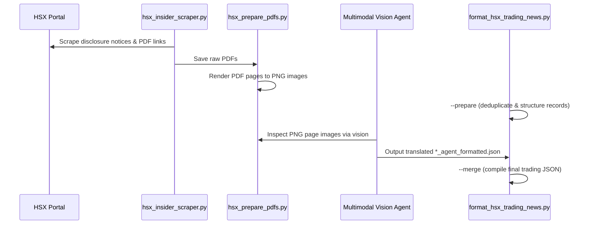
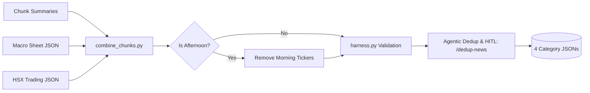
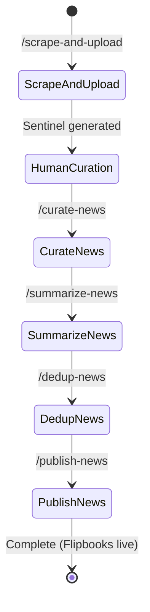

# Architecture of KIS Daily News Report Pipeline

This document provides a comprehensive technical reference for the architecture, component interaction, data flow, agent layer, and publication systems powering the KIS Vietnam Securities Corporation automated daily news bulletin pipeline.

---

## 1. Executive Summary & System Objectives

The **KIS Daily News Report Pipeline** is an enterprise-grade financial intelligence and automated publishing platform. It collects, curates, summarizes, deduplicates, and compiles domestic Vietnamese financial news, market movements, macroeconomic indicators, and regulatory insider trading filings into daily morning and afternoon publications.

### Primary Objectives
- **End-to-End Automation with Human Curation**: Seamless transition between autonomous data scraping, human editorial oversight (via Google Sheets), agent-driven summarization, and automated publication.
- **Multimodal PDF Intelligence**: Direct vision extraction of structured insider trading transactions from scanned, non-searchable Vietnamese regulatory PDFs without brittle local OCR engines.
- **Strict A4 Print-Ready Layout**: Generation of pixel-perfect, fixed-canvas A4 digital flipbooks and printable PDFs (Vietnamese and English) complying with strict KIS Vietnam institutional brand guidelines.
- **Semantic Deduplication**: 30-day vector similarity deduplication and morning-to-afternoon cross-report deduplication to eliminate redundant coverage.
- **Zero Hallucination & Traceability**: Strict lineage from original news URLs and official State Securities Commission (SSC) / HSX PDF attachments down to final rendered bullet points.

---

## 2. High-Level Architecture

The platform is structured into four sequential execution phases, orchestrated through Windows scheduled runners and an autonomous Antigravity (AGY) agent layer:

```mermaid
flowchart TD
    subgraph Phase01 [Phase 01: Ingestion & Multimodal Extraction]
        P1_Scrape[main.py: RSS, Web & FireAnt API] --> CSV[Scraped Articles CSV]
        P1_HSX[hsx_insider_scraper.py] --> HSX_PDFs[Download PDFs & Render PNGs]
        HSX_PDFs --> P1_Vision[Multimodal Agent Vision Extraction]
        P1_Vision --> HSX_JSON[hsx_insider_trading_extracted.json]
    end

    subgraph Phase02 [Phase 02: Human-in-the-Loop Curation]
        CSV --> SheetsUpload[upload-to-sheets.js]
        SheetsUpload --> GSheets[(Google Sheets Session Tab)]
        GSheets -->|Analyst marks TAKE & fills Macro| SheetsRead[generate-report.js & read-macro-sheet.js]
        SheetsRead --> SourceMD[reports/base/source/base.md]
        SheetsRead --> MacroJSON[reports/base/data/macro_sheet.json]
    end

    subgraph Phase03 [Phase 03: Summarization & Deduplication]
        SourceMD --> FetchText[fetch_full_articles.py]
        FetchText --> Chunker[prepare_chunks.py]
        Chunker --> LLMSummarize[Agent Summarization: KIS Writing Style]
        LLMSummarize --> Combiner[combine_chunks.py: Merges Chunks + HSX + Macro]
        Combiner --> HarnessCheck[harness.py: Editorial Constraints]
        HarnessCheck --> AgentDedup[/dedup-news: Agentic Dedup & HITL Review]
        AgentDedup --> FinalJSONs[(4 Validated Category JSONs)]
    end

    subgraph Phase04 [Phase 04: Visual Compilation & Publishing]
        FinalJSONs --> HTMLGen[generate_html_report_standard.py]
        HTMLGen --> HTMLFiles[A4 Branded HTML: VN & EN]
        HTMLFiles --> PlaywrightPDF[generate_pdf_report.py: Headless Chromium]
        HTMLFiles --> DocxGen[generate_docx_report.py: Word Bulletin]
        PlaywrightPDF --> HeyzineUpload[run-upload.js: Flipbook Publishing]
    end

    Phase01 --> Phase02
    Phase02 --> Phase03
    Phase03 --> Phase04
```

---

## 3. Detailed Component Breakdown

### Phase 01: Ingestion & Multimodal Extraction (`phases/01_scrape/`)

1. **News Scraper (`main.py`)**:
   - Multi-threaded aggregator pulling from top Vietnamese financial portals (VnEconomy, CafeF, Vietstock, BaoDauTu, NDH) and RSS feeds.
   - **FireAnt REST API with Selenium Fallback**: Extracts dynamic bearer tokens directly from `fireant.vn` to query REST endpoints, falling back to headless Selenium only when API tokens expire.
   - Produces timestamped CSV containing title, link, source, publication time, and preliminary category tagging.

2. **HSX Insider Trading Pipeline**:
   - **`hsx_insider_scraper.py`**: Queries the Ho Chi Minh City Stock Exchange (HSX) disclosures portal, filters specifically for insider trading actions, and downloads filing attachments.
   - **`hsx_prepare_pdfs.py`**: Converts multi-page disclosure PDFs into high-resolution PNG page images.
   - **`format_hsx_trading_news.py`**: Orchestrator for agent translation and structured formatting:
     - `--prepare`: Deduplicates transactions and formats raw records into `*_to_format.json`.
     - **Multimodal Agent**: Evaluates rendered PNG page images directly using visual reasoning to extract exact trading volumes, transaction dates, insider roles, and ownership percentages.
     - `--merge`: Combines agent translations into `*_extracted_formatted.json`.



---

### Phase 02: Editorial Curation (`phases/02_curate/`)

1. **Google Sheets Synchronization (`upload-to-sheets.js`)**:
   - Connects to Google Sheets via Playwright CDP (`127.0.0.1:9222`) or authenticated service sessions.
   - Populates session tabs named `mor_DD_MM_YYYY` or `after_DD_MM_YYYY`.
   - **Upload Idempotency Sentinel**: Checks `phases/02_curate/logs/{session}_{YYYYMMDD}.done` prior to running. If the sentinel file exists, the upload halts immediately to prevent overwriting analyst selections.

2. **Human Editorial Layer**:
   - Analysts review the scraped items in Google Sheets, marking relevant stories with `TAKE`.
   - Morning sessions: Analysts populate the `Macro` and `vin_bank` tabs with overnight indices, exchange rates, and banking data.

3. **Curated Source Compilation (`generate-report.js` & `read-macro-sheet.js`)**:
   - `generate-report.js`: Parses all `TAKE`-marked rows from Sheets and writes structured markdown to `reports/{base}/source/{base}.md`.
   - `read-macro-sheet.js`: Reads macro tab data and dynamically builds descriptive, quantitative commodity news titles (e.g. SJC gold, Phu Quy silver, Live hog price ranges).

---

### Phase 03: Summarization & Semantic Deduplication (`phases/03_summarize/`)

1. **Full Article Retrieval (`fetch_full_articles.py`)**:
   - Resolves URLs from `reports/{base}/source/{base}.md`, downloads DOM trees, strips clutter (ads, sidebars), and caches raw markdown text.

2. **Chunking & Summarization (`prepare_chunks.py`)**:
   - Groups articles into manageable batches for LLM summarization.
   - Summarization applies institutional KIS writing principles: neutral analytical tone, standardized ticker notations (`Ticker (Company name, Exchange)`), and strict translation mappings.

3. **Data Combination & Classification (`combine_chunks.py`)**:
   - Merges chunk outputs, HSX trading data, and Macro sheet data into 4 standardized JSON files under `reports/{base}/data/`:
     - `{base}_macro.json`
     - `{base}_trading.json`
     - `{base}_corporate.json`
     - `{base}_economy_political_others.json`
   - **Corporate Earnings Override**: Earnings release filings override generic newsfeed items for the same ticker.
   - **Morning-to-Afternoon Deduplication**: Afternoon runs automatically inspect the morning report's corporate tickers and remove already-covered items.

4. **Agentic Deduplication & HITL Review (`/dedup-news`)**:
   - Pure agentic review in the LLM reasoning context (no fragile vector libraries, broken DLLs, or stale NPZ index files).
   - Detects intra-session duplicates (same ticker corporate actions, same government decrees, same commodity price reports).
   - Cross-references recent prior reports (e.g. morning session if afternoon) to eliminate recurring stories.
   - Interactive HITL editing allows editors to drop, add, edit, or merge stories before publishing.



---

### Phase 04: Publishing & Visual Compilation (`phases/04_publish/`)

1. **Canonical Production HTML Generator (`generate_html_report_standard.py`)**:
   - Compiles dual bilingual HTML bulletins: `*_report_vn.html` and `*_report_en.html`.
   - Renders strict A4 canvas pages (`210mm × 297mm`) with zero-margin print CSS.
   - Organizes content in a balanced 2x2 grid (maximum 4 stories per content page).
   - Injects coversheet graphics via `coversheet.py` and standard Outro back cover.

2. **Playwright PDF Compiler (`generate_pdf_report.py`)**:
   - Launches headless Chromium via Playwright, loads local HTML via absolute `file:///` URLs, injects print stylesheets, and prints to true A4 with CSS page size control.

3. **Word Document Generator (`generate_docx_report.py`)**:
   - Compiles institutional `.docx` documents mirroring report structure for editorial archiving.

4. **Visual Regression Benchmark (`benchmark_html_against_pdf.py`)**:
   - Renders HTML pages to image snapshots and verifies them against compiled PDF page images to ensure zero footer collisions, header alignment, and layout fidelity.

5. **Flipbook Uploader (`run-upload.js`)**:
   - Publishes final PDF reports to the Heyzine platform via automated CDP / API workflows, returning shareable flipbook URLs.

---

## 4. Typography & Layout Specifications

Visual rendering adheres to strict institutional print guidelines documented in [DESIGN.md](file:///W:/KIS-DAILY-NEWS/DESIGN.md):

```
┌────────────────────────────────────────────────────────────────────────┐
│ COVER PAGE (A4: 210mm x 297mm)                                        │
│  [Top-Left Header: BẢN TIN BUỔI SÁNG / MORNING NEWS]                  │
│  [Top-Left Company: CTCP CHỨNG KHOÁN KIS VIỆT NAM]                    │
│  [Date: Bolded publication date]                                       │
│                                                                        │
│  [Center / Background: KIS Institutional Coversheet Art]               │
│                                                                        │
│  [Bottom-Right Session: CAFE CHỨNG KHOÁN / MARKET ESPRESSO]           │
│  [Tagline: Trung tâm Phân Tích - Bản Tin Tổng Hợp]                     │
├────────────────────────────────────────────────────────────────────────┤
│ CONTENT PAGES (2 Columns x 2 Rows = Max 4 Stories per Page)           │
│  ┌─────────────────────────────────┬─────────────────────────────────┐ │
│  │ Story 1 (Title 15px bold,       │ Story 2 (Title 15px bold,       │ │
│  │          Body 15px regular)     │          Body 15px regular)     │ │
│  ├─────────────────────────────────┼─────────────────────────────────┤ │
│  │ Story 3 (Title 15px bold,       │ Story 4 (Title 15px bold,       │ │
│  │          Body 15px regular)     │          Body 15px regular)     │ │
│  └─────────────────────────────────┴─────────────────────────────────┘ │
│  [Footer: Company Logo (Left) ───────── Horizontal Rule ──── Page Num] │
├────────────────────────────────────────────────────────────────────────┤
│ OUTRO PAGE (Back Cover)                                                │
│  [Top: CTCP CHỨNG KHOÁN KIS VIỆT NAM / KIS VIETNAM SECURITIES]         │
│  [Center: TRÂN TRỌNG CẢM ƠN / THANK YOU]                               │
│  [Bottom: Bilingual Legal & Research Disclaimer + Copyright 2026]      │
└────────────────────────────────────────────────────────────────────────┘
```

### Vietnamese Diacritics Typography Rule
- Standard system fonts often trigger synthetic or mismatched font fallbacks on Vietnamese uppercase diacritics (`Ả`, `Ổ`, `Ề`, `Ứ`, `Á`).
- **Rule**: Cover titles (`.cover-company`, `.cover-session`) must use `'Segoe UI Black', 'Segoe UI', Arial, sans-serif` with `font-weight: 900;` to guarantee uniform glyph weight and diacritical positioning.

---

## 5. Antigravity (AGY) Agent System

The repository is integrated with Antigravity 2.0. The agent configuration lives in `.agents/`:

```
.agents/
  rules/
    pipeline-rules.md     ← execution safety rules & python interpreter constraints
  skills/
    scrape-and-upload/    ← automated scraping & sheets push
    curate-news/          ← reads TAKE rows from Sheets into markdown
    summarize-news/       ← chunking, LLM summarization, category JSON build
    dedup-news/           ← 30-day semantic dedup check & index updates
    publish-news/         ← schema validation, HTML/PDF/DOCX & Heyzine upload
    paste-news/           ← ad-hoc raw news insertion
    delta-summarize/      ← incremental summarization of newly added TAKE rows
    kis-writing-style/    ← institutional voice, terminology & translation rules
  AGENTS.md               ← agent operational guide and rule index
```

### Agent Auto-Chaining Sequence



---

## 6. Directory Map & Artifact Lifecycle

All generated run data lives strictly in `reports/{base}/` where `base` is formatted as `{mor|after}_DD_MM_YYYY`:

```
reports/{base}/
  ├── source/
  │   └── {base}.md                                  ← raw TAKE items from Google Sheets
  ├── summaries/
  │   ├── chunk_1.json, chunk_2.json ...             ← intermediate LLM chunk outputs
  │   └── articles_full_text.json                    ← downloaded full article DOM text
  ├── data/
  │   ├── {base}_macro.json                          ← Macro commentary & indicators
  │   ├── {base}_trading.json                        ← HSX insider trading transactions
  │   ├── {base}_corporate.json                      ← Corporate news grouped by sector
  │   ├── {base}_economy_political_others.json       ← Economy, politics, commodities
  │   └── macro_sheet_{DD_MM_YYYY}.json              ← raw dump from Google Sheets Macro tab
  ├── exports/
  │   ├── html/
  │   │   ├── {base}_report_vn.html                  ← Vietnamese A4 HTML report
  │   │   └── {base}_report_en.html                  ← English A4 HTML report
  │   ├── pdf/
  │   │   ├── {base}_report_vn.pdf                   ← Print-quality Vietnamese PDF
  │   │   └── {base}_report_en.pdf                   ← Print-quality English PDF
  │   └── docx/
  │       ├── {base}_report_vn.docx                  ← Vietnamese Word document
  │       └── {base}_report_en.docx                  ← English Word document
  └── testing/
      ├── playwright-images/                         ← rendered page PNGs for visual testing
      └── diffs/                                     ← layout comparison diffs
```

---

## 7. Operational Guidelines & Safety Constraints

1. **Python Virtual Environment Policy**:
   - All Python scripts must execute using `phases/01_scrape/venv/Scripts/python.exe`. Never invoke global `python` or other virtual environments.
2. **Upload Idempotency Guard**:
   - `upload-to-sheets.js` must never run if `phases/02_curate/logs/{session}_{YYYYMMDD}.done` exists. This protects analyst curation work from accidental overwrites.
3. **No Local OCR on Regulatory Filings**:
   - HSX disclosure PDFs must be rendered to PNG images and analyzed directly via multimodal vision models to avoid OCR transcription failures.
4. **Preserve Unicode NFC Normalization**:
   - All Vietnamese text outputs must be stored in standard Unicode NFC normalization (`unicodedata.normalize("NFC", text)`).
5. **Path Isolation**:
   - Path operations must always use `core_tools/paths/report_paths.py` (Python) or `core_tools/paths/report-paths.js` (Node). No hardcoded paths are permitted.
